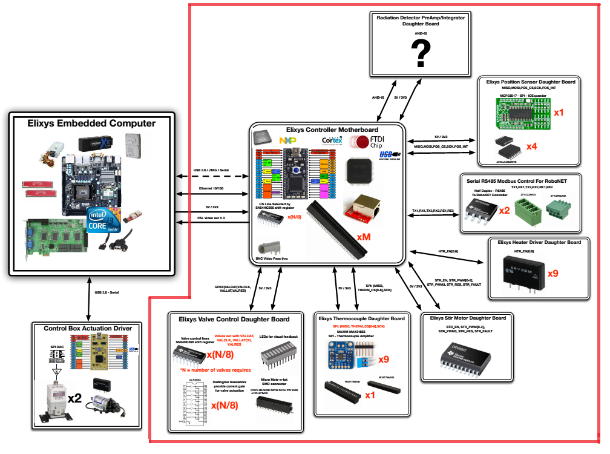

===============
System Overview
===============

   
The synthesizer control board is designed to provide sensing and actuatation to all the 
subsystems necessary for correct function of the **Elixys** Radiochemistry system.

The controller provide an easily upgradable interface that communicates
with a host over ethernet. Firmware, programming and debugging is easy as the JTAG interface
a serial console are accessible via USB.

A ARM Cortex-M3 microcontroller is used to drive all the subsystems. 
Nearly all subsystems can be communicated with over a SPI interface.
To allow for a nearly infinite number of subsystems a shift register 
architecture is used allowing just 4 additional signals to control all of the 
chip select signals on each of the various periphreal components.

The top-level schematic is available as *SynthesizerBoarch.sch*.  
It shows the various child schematics.

* Controller (*SynthesizerController.SchDoc*)
	* Controller module allows a host to send the remote sysnthesizer unit commands and return system state. This is the primary system controller and uses ethernet for all communication.  Debugging, programming and serial console are all available via a USB peripheral connection.
	
	* Signals
	
		* SCK - SPI Clock signal (P0.7)
		* MOSI - SPI Master Output Slave Input (P0.9)
		* MISO - SPI Master Input Slave Output (P0.8)
		* CSDAT - Chip select data (P1.24)
		* CSSCK - Chip select clock (P1.20)
		* CSCLR - Chip select clear (P1.22)
		* CSOE -  Chip select output enable (P1.25)
		* POSDIGINT - Position sensor digital interrupt (P2.11)
		* POSRST - Position sensor reset (P2.12)
		* MOTOR[0-3] - 4x PWM signals (P2.0, P2.1, P2.2, P2.3)
		* MTRRST - Motor driver reset (P2.6)
		* MTRFLT - Motor driver fault detection (P2.13)
		* VALVRST - Valve reset (P2.7)
		* RAD[0-5] - 6x Radiation detector analog input (P0.23, P0.24, P0.25, P0.26, P1.30, P1.31)
		
* Chip Select Array (*SynthesizerChipSelectArray.SchDoc*)
	* This submodule allows the controller to select the active subsystem on the SPI peripheral bus.
	* Signals
		
		* CSDAT - Chip select data (P1.24)
		* CSSCK - Chip select clock (P1.20)
		* CSCLR - Chip select clear (P1.22)
		* CSOE -  Chip select output enable (P1.25)
		* TCCS[0-8] - Thermocouple digital converter chip select lines
		* HTRCS - Heater chip select line
		* LIQCS - Liquid sensor chip select line
		* SMCADCCS - ADC chip select line
		* SMCDACCS - DAC chip select line
		* VALVCS[0-3] - Valve IO multiplier chip select line
		
* Mixer Motor Driver (*SynthesizerMixerMotorDriver.SchDoc*)
	* Allows the system to drive up to 4 2amp motors.
	* Signals
	
		* MOTOR[0-3] - 4x PWM signals (P2.0, P2.1, P2.2, P2.3)
		
* Digital Inputs (*SynthesizerDigitalInputs.SchDoc*)
	* This subsystem provides the 6 pneumatic axis with the required 12 position sensors.
	* Signals
		
		* SCK - SPI Clock signal (P0.7)
		* MOSI - SPI Master Output Slave Input (P0.9)
		* MISO - SPI Master Input Slave Output (P0.8)
		* POSDIGINT - Position sensor digital interrupt (P2.11)
		* POSRST - Position sensor reset (P2.12)
				
* Temperature Controllers (*SynthesizerTemperatureController.SchDoc*)
	* Provides 9 thermocouple digital converters and 10 Solid state relays for heater actuation as well as one dedicated relay for the vacuum pump.
	* Signals
	
		* SCK - SPI Clock signal (P0.7)
		* MOSI - SPI Master Output Slave Input (P0.9)
		* MISO - SPI Master Input Slave Output (P0.8)
		* TCCS[0-8] - Thermocouple digital converter chip select lines
		* HTRCS - Heater chip select line
		
	
* Liquid Sensors (*SynthesizerLiquidSensor.SchDoc*)
	* For future expansion, we expect to require liquid sensors during the transfer of fluid from the system into the HPLC loop.
	* Signals
	
		* SCK - SPI Clock signal (P0.7)
		* MOSI - SPI Master Output Slave Input (P0.9)
		* MISO - SPI Master Input Slave Output (P0.8)
		* LIQCS - Liquid sensor chip select line
	
	

* General SMC Misc Interface (*SynthesizerSMCMiscInterface.SchDoc*)
	* Can be used to interface with SMC style pressure regulators and sensors.
	* Signals
		
		* SCK - SPI Clock signal (P0.7)
		* MOSI - SPI Master Output Slave Input (P0.9)
		* MISO - SPI Master Input Slave Output (P0.8)
		* SMCADCCS - ADC chip select line
		* SMCDACCS - DAC chip select line
		
* 4 x Valve Drivers (*SynthesizerValveDriver.SchDoc*)
	* Elixys requires 4 of these 16 channel pneumatic 24V valve drivers.
	* Signals 
	
		* SCK - SPI Clock signal (P0.7)
		* MOSI - SPI Master Output Slave Input (P0.9)
		* MISO - SPI Master Input Slave Output (P0.8)
		* VALVCS[0-3] - Valve IO multiplier chip select line
		* VALVRST - Valve reset

---------
Schematic
---------
(SynthesizerBoard.SchDoc)